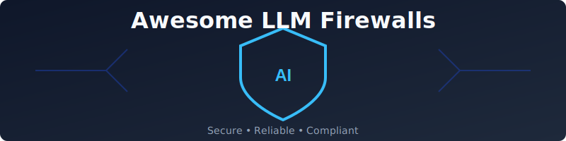

# 🛡️ Awesome LLM Firewalls & Guardrails

  

  
  
  
  

---

## 🚀 The Ultimate LLM Security & AI Guardrails Ecosystem

**Curated List of SaaS Products & Open-Source GitHub Projects**  
*Focused on Prompt Injection Protection, Output Moderation & LLM Security Operations (SecOps)*

> [!IMPORTANT]
> **LLM Security is an evolving field.** This repository tracks the best tools to protect your AI applications from prompt injection, toxic output, PII leakage, and hallucinations.

### 🌐 Overview
This repository provides a comprehensive directory of **LLM Firewalls**, **Guardrails**, and **AI Security Gateways**. Whether you are building an enterprise agent or a simple chatbot, these tools help ensure your LLM interactions are **safe, compliant, and reliable**.

---

## 📑 Table of Contents
- [✨ SaaS Products](#saas-products)
- [🛠️ Open-Source GitHub Projects](#open-source-github-projects)
- [🤝 How to Contribute](#how-to-contribute)
- [⚠️ Disclaimer](#disclaimer)

---

## ✨ SaaS Products

### 🏆 Top LLM Firewalls & Guardrails (SaaS)

| Product | 📝 Description | 💰 Pricing | 🎁 Free Tier / Limits | 🏢 Size / Valuation |
| :--- | :--- | :--- | :--- | :--- |
| **[NVIDIA NeMo Guardrails](https://www.nvidia.com/en-us/ai-data-science/generative-ai/nemo-framework/)** | Cloud-native NIMs for controlling LLM safety and alignment. | $4,500/GPU/year | **1,000 free credits** | **$4.7T** (Market Cap) |
| **[Cloudflare Firewall for AI](https://www.cloudflare.com/ai-gateway/)** | Edge-based security gateway providing protection and observability. | Free / $20/mo | **100,000 logs/day** | **$80B** (Market Cap) |
| **[Akamai Firewall for AI](https://www.akamai.com/)** | Enterprise layer protecting against injections and leakage. | Usage-based | **$100 credits** | **$16B** (Market Cap) |
| **[Protect AI](https://protectai.com/)** | Scanning models and providing runtime guardrails. | Custom Enterprise | **14-day trial** | **$700M** (Acquired) |
| **[Arthur AI (Shield)](https://www.arthur.ai/product/shield)** | Detection of hallucinations and toxicity with guardrails. | From $60/mo | **Available** | **$324M** (Valuation) |
| **[Lakera Guard](https://lakera.ai/)** | Leading prompt injection defense with sub-50ms latency. | Tiered (Pro/Ent) | **10,000 reqs/mo** | **$300M** (Acquired) |
| **[Witness AI](https://witness.ai/)** | Network-layer visibility and semantic routing. | ~$180/user/yr | **N/A** | **$275M** (Valuation) |
| **[HiddenLayer](https://hiddenlayer.com/)** | MLDR platform providing threat detection for AI/ML. | Custom Enterprise | **N/A** | **$271M** (Valuation) |
| **[CalypsoAI Moderator](https://calypsoai.com/)** | Advanced moderation with customizable policies. | Tiered subs | **Contact Sales** | **$145M** (Acquired) |
| **[Lasso Security](https://lasso.security/)** | Comprehensive guardrails and threat detection. | $39/mo (Std) | **Free trials** | **$70M** (Valuation) |
| **[Bifrost (Maxim AI)](https://www.getmaxim.ai/)** | High-performance AI gateway with virtual keys. | Free + Paid | **Free Tier** | **$8M** (Valuation) |
| **[WhyLabs LLM Security](https://whylabs.ai/)** | Observability-first security platform. | $50/mo per model | **Free Account** | **Undisclosed** |

---

## 🛠️ Open-Source GitHub Projects

### 🔒 Dedicated LLM Firewall & Guardrails Projects

- **[LangChain](https://github.com/langchain-ai/langchain)**  🦜  
  Built-in guardrails and output parsers within the popular LangChain ecosystem for secure agent and chain execution.

- **[Llama Guard / PurpleLlama](https://github.com/meta-llama/PurpleLlama)**  🦙  
  Open-source safety classifier models and tools from Meta for content moderation and risk detection.

- **[Presidio](https://github.com/microsoft/presidio)**  🔍  
  Microsoft’s open-source PII detection and anonymization toolkit for LLM pipelines.

- **[Outlines](https://github.com/outlines-dev/outlines)**  📐  
  Guided text generation with regex and JSON schemas for safe and structured output.

- **[Guardrails AI](https://github.com/guardrails-ai/guardrails)**  ⚖️  
  Framework for structural and semantic validation of LLM outputs.

- **[NVIDIA NeMo Guardrails](https://github.com/NVIDIA/NeMo-Guardrails)**  🟢  
  Programmable guardrails for conversational systems, including topical and safety rails.

- **[LLM Guard](https://github.com/protectai/llm-guard)**  🛡️  
  Comprehensive toolkit for detecting prompt injections, toxicity, and PII leakage.

- **[Rebuff](https://github.com/protectai/rebuff)**  🥊  
  Multi-layer prompt injection detection and defense framework.

### ➕ Additional Strong Open-Source Options

- **[TextAttack](https://github.com/QData/TextAttack)**  — Adversarial testing and attack generation. ⚔️
- **[NeMo Guardrails Examples](https://github.com/NVIDIA/NeMo-Guardrails)** — Production guardrail templates. 📋
- **[Prompt Security Tools](https://github.com/search?q=prompt+injection+detection)** — Community injection detection. 🕵️
- **[AICL Guard](https://github.com/search?q=ai+content+moderation)** — Content safety classifiers. 🏷️
- **[LangSmith / LangChain tracing]** — Trace-based guardrails. 📊
- **[Ollama + Guardrails]** — Local safe LLM deployment. 🏠
- **Many RAG-specific guardrail** repositories for retrieval safety. 🗂️

---

## 🤝 How to Contribute

We love contributions! Follow these steps to add your project:
1. 🍴 **Fork** the repository.
2. 📝 **Add** your entry (follow the existing format).
3. 🚀 **Submit** a Pull Request with a clear description.

---

## 📈 Star History

  

---

## ⚠️ Disclaimer

- This is a **community-curated** list. Use of these tools is at your own risk.
- LLM security is an evolving space; always employ **defense-in-depth**.

**Made with ❤️ for the AI Security Community.**